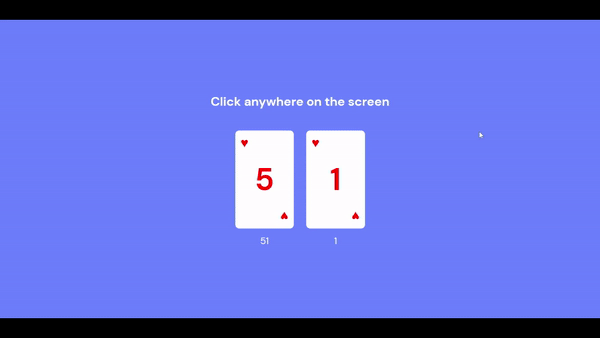
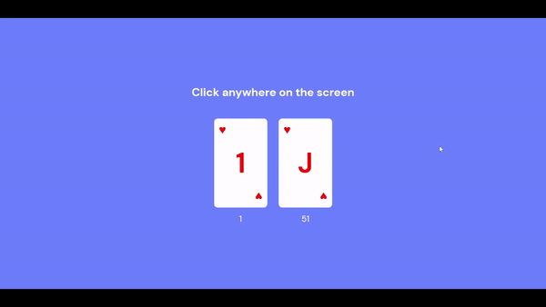
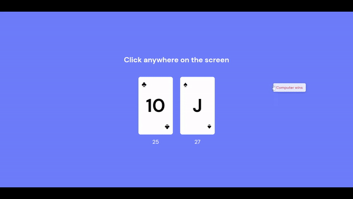

<h1>War, the card game, built with basic HTML,CSS,JS</h1>

Just wanted to practice a bit of class based JS programming. I've used basic JS ES6 principles, a few CSS styles and animations and just some regular, plain old HTML. I've also attached a few gifs to show you how it works.

